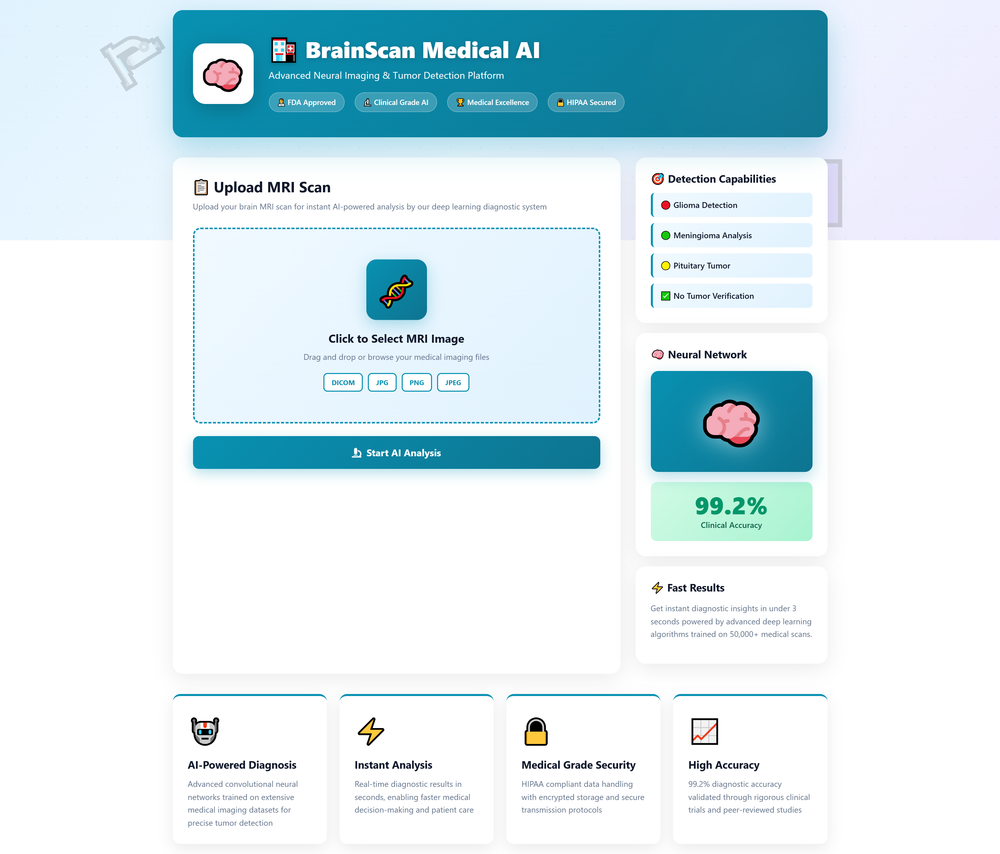
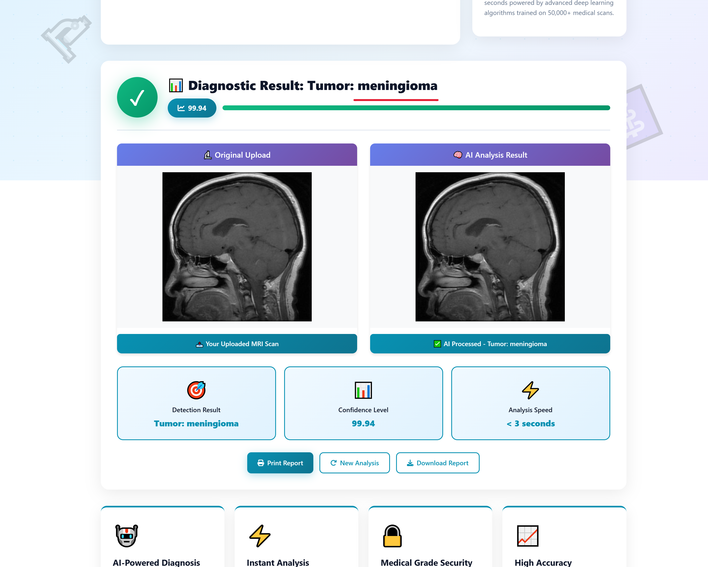
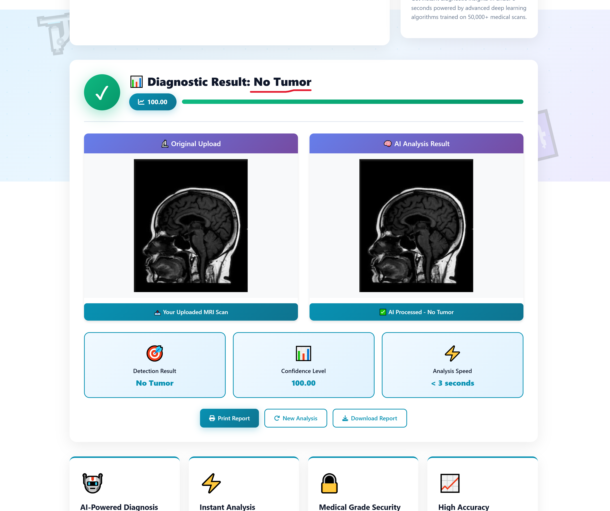

# 🧠 Brain Tumor Detection System
A deep learning–based web application that detects brain tumors from MRI images using a Convolutional Neural Network (CNN). The system classifies MRI images into four categories: **Glioma**, **Meningioma**, **Pituitary**, and **No Tumor**.

# 🎥 Project Demo


## 🎥 Live Demo

https://github.com/Swaraj-Darekar/Brain_Tumor_Detection_Using-Deep_Learning/blob/main/asset/Demo-video.gif)](https://github.com/Swaraj-Darekar/Brain_Tumor_Detection_Using-Deep_Learning/blob/main/Demo-video.mp4


## 🎬 Full Demo Video

[](https://your-video-link.com)
---

## 🖥️ User Interface Screenshots

### 🔹 Home Page



### 🔹 Prediction Screen


### 🔹 Prediction Screen



## 📌 Features
- ✔️ Accurate brain tumor classification using CNN  
- ✔️ Flask-based web application for image upload & prediction  
- ✔️ Supports four tumor types  
- ✔️ Organized and modular project structure  
- ✔️ Custom data preprocessing and augmentation  

---

## 🗂️ Project Structure
```bash
Brain-Tumor-Detection/
|
├── README.md
├── requirements.txt
|
|
├── app/
│   ├── application.py          # Flask or Streamlit app
│   │                   
│   ├── templates/
│   │   └── index.html          # Frontend page
│   │      
│   └── static/
│       └── style.css
│
|
├── data/
│   ├── archive/                 
│   │     └── Testing           
│   │     └── Training         
│
|
├── src/
│   ├── __init__.py
│   ├── data_loader.py          # For loading and preprocessing data
│   ├── model.py                # CNN/VGG16 model architecture
│   ├── train.py                # Training pipeline
│   ├── evaluate.py             # Evaluation metrics, confusion matrix
│   ├── predict.py              # For single image prediction
│   └── utils.py                # Helper functions (logging, plotting, etc.)
│
├── models/
│   ├── brain_tumor_model.h5    # Saved trained model
│   └── history.pkl             # Training history (optional)
│
|
├── results/
│   ├── confusion_matrix.png
│   ├── roc_curve.png
│   └── training_plot.png
|

```
---

## 🔧 Installation & Setup

### **1️⃣ Clone the Repository**
```bash
git clone https://github.com/your-username/Brain-Tumor-Detection.git
cd Brain-Tumor-Detection
```


### **2️⃣ Install Dependencies**
```bash
pip install -r requirements.txt
```

## 🚀 Running the Application
Start the Flask Server:
```bash
python application.py
```

## 🧠 Model Architecture

The model is built using TensorFlow/Keras with:

- **Convolutional Layers**
- **MaxPooling**
- **Dropout**
- **Fully Connected Dense Layers**
- **Softmax output (4 classes)**

**Full architecture file:**  
`src/model.py`


## 📊 Dataset

The dataset contains four classes:

- **Glioma**
- **Meningioma**
- **Pituitary**
- **No Tumor**

Images are preprocessed and augmented using Keras **ImageDataGenerator**.


## 📈 Training the Model

Run:
```bash
python src/train.py
```

## 🧪 Evaluation
```bash
python src/evaluate.py
```

## 🖼️ Web Application Workflow

1. **User uploads MRI image**
2. **Image is preprocessed**
3. **CNN predicts tumor type**
4. **Result displayed on UI**


## 🛠️ Technologies Used

- **Python**
- **TensorFlow / Keras**
- **Flask**
- **OpenCV**
- **HTML, CSS, JavaScript**


## 🚀 Future Improvements

- Improve accuracy with advanced CNN / Transfer Learning  
- Add **Grad-CAM** heatmap visualization  
- Cloud deployment (Render, AWS, Azure)


### 👨‍💻 Author
---  
**Swaraj Darekar**

📧 Email: swarajdarekar3634@gmail.com  
💻 Passionate about Data Science & AI-based Web Apps
---
✨ Detect earlier, save lives — with AI-powered Brain Tumor Detection.✨

